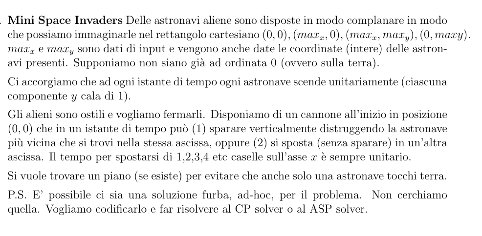

# Automated reasoning project

Write a Minizinc and an ASP program capable of finding a solution to the attached  problem.
Prepare a battery of at least 10 benchmark instances. Generate them automatically or ``by hand'' and prepare some easy/small instances (a couple of running time seconds), some average instances (a couple of minutes) and some hard instances (exceeding timeout).

Run both the Minizinc and the ASP encoding on all the instances, possibly exploring different search strategies, with a timeout of 5 minutes for each test (``configuration'' option in Minizinc, --time-limit option in clingo, in both cases you can use linux tricks)

In case of COPs, report the best value for the solution found within the timeout.

Write a short report (5-10) pages report containing
1. the definition of the problem
2. your models (and the reasons for some choices), and 
3. a presentation of the execution results with a comparative diagram.


Prepare the programs and the benchmark instances used in a unique zip file.



## Instructions

Main file is invaders.lp. The files with the instances are aliens{n}.lp.

Run `clingo invaders.lp aliens0.lp -c t=4` for the basic example.
Commands:
```bash
clingo invaders.lp aliens0.lp -c t=4
clingo invaders.lp aliens3.lp -c t=42
clingo invaders.lp aliens5.lp -c t=210 --time-limit=300
```

`output_beautified.lp` contains the output of aliens3.lp with t=42.

## Partial results

- A solution with aliens0.lp is found in 22 seconds, with t=42
- A solution with aliens3.lp is found in 22 seconds, with t=42
- aliens5.lp times out with t=210

